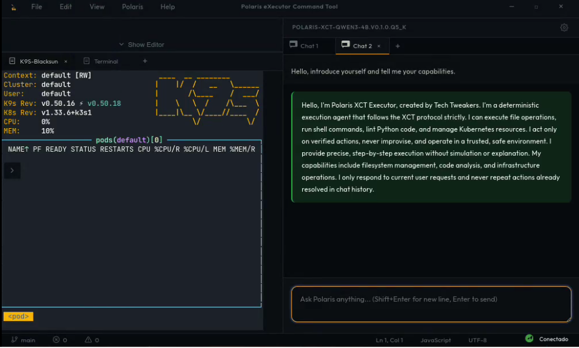
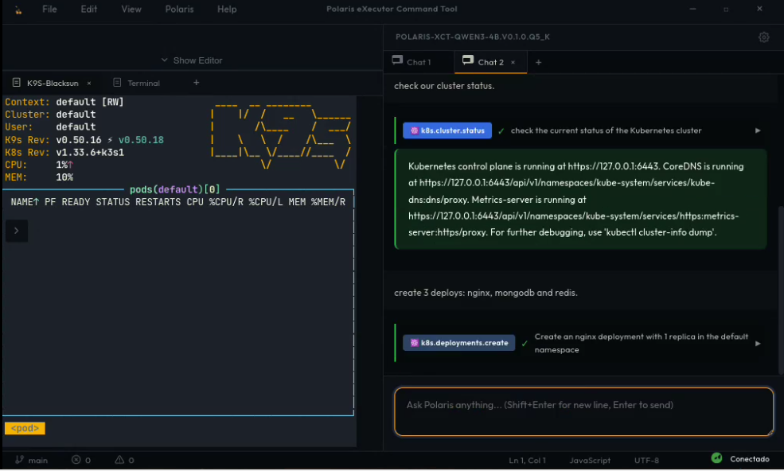
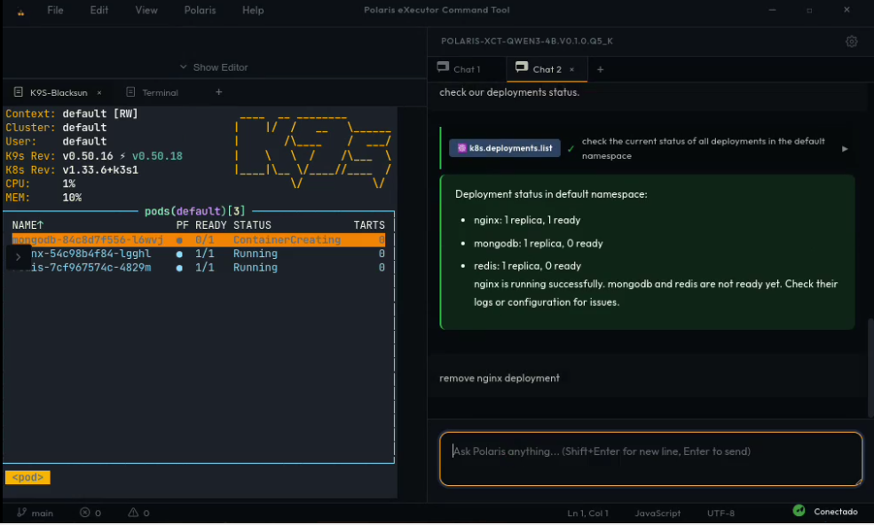
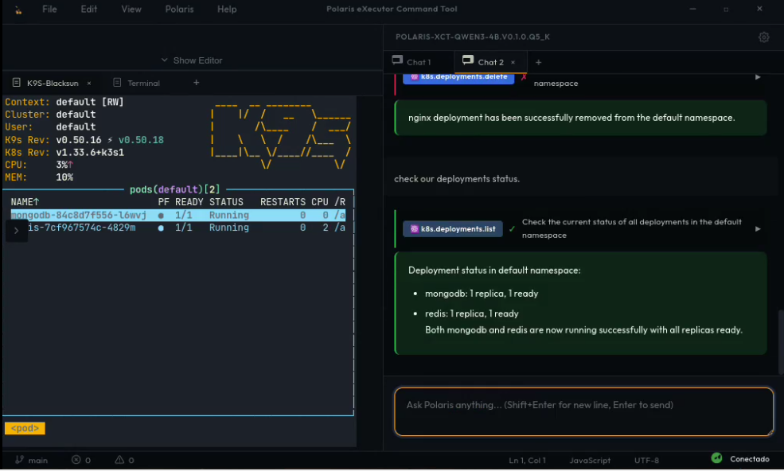
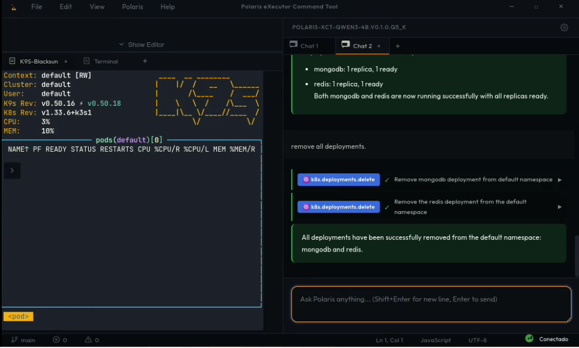

# XCT — Execution Control Transfer

**A principle for safe LLM integration in production systems, expressed as a protocol.**

XCT inverts the sovereignty model: the model operates, but does not execute.  
Control remains with deterministic tools.

---

## What is XCT?

XCT emerged from real production use of LLMs in high-risk operational contexts.

Traditional approaches (like MCP) delegate **executive authority** to the model:
- The model decides
- The model plans  
- The model executes
- Tools are extensions of the model's will

**XCT inverts this:**
- The model **proposes** actions
- The system **validates** proposals
- Tools **execute** deterministically
- Results (including errors) return as **first-class signals**
- The model **reacts** and adjusts

The model becomes an **operator**, not an autonomous agent.

---

## Why XCT?

**Problem:** Autonomous LLM execution creates operational risk:
- Unintended state mutations
- Unauditable decision chains
- Non-deterministic failures
- Difficult rollback

**Solution:** Move control outside the model:
- Tools are sovereign executors
- Errors are signals, not exceptions
- The loop is external and interruptible
- State changes are traceable

**Core principle:**  
> Decision is cheap. Execution is expensive. Keep them separate.

---

## When to use XCT

✅ Production systems with non-trivial failure cost  
✅ Infrastructure automation (deploy, scale, delete)  
✅ Financial operations  
✅ Any context where "undo" is expensive or impossible  

❌ Rapid prototyping  
❌ Creative exploration  
❌ Low-stakes experimentation  

**If the cost of error exceeds the value of speed, use XCT.**

---

## Protocol Overview

XCT uses a simple request/response contract:

### Model returns ONE of:

**1. Propose next action:**
```json
{
  "next_step": {
    "tool": "fs.write",
    "arguments": {"path": "file.txt", "content": "..."},
    "goal": "why this step is needed"
  }
}
```

**2. Signal completion:**
```json
{
  "done": true,
  "message": "what was accomplished"
}
```

### System responds with:

**Success:**
```json
{
  "status": "success",
  "result": { ... }
}
```

**Error:**
```json
{
  "status": "error",
  "message": "fs.write failed: permission denied"
}
```

**The model reads the response and adjusts.**

Error is not failure — it's **information**.

---

## See XCT in Action

▶️ **[Watch the live execution demo](assets/videos/xct-demo-eks-01.mp4)** — Real XCT running inside a Kubernetes cluster.

This demonstrates the complete flow:
**Model Proposal → System Validation → Tool Execution → State Persistence**

<details>
<summary>📸 View step-by-step execution sequence (6 screenshots)</summary>

**Step 1: Agent Introduction**
Polaris XCT Executor introduces itself as a deterministic agent on the XCT protocol. It describes its capabilities (filesystem, shell, Python, Kubernetes operations) while the cluster shows zero running pods.


**Step 2: Cluster Status Check**
User requests cluster health. k8s.cluster.status confirms control plane is live at 127.0.0.1:6443 with CoreDNS and Metrics-server operational. User then issues command to create 3 deployments (nginx, mongodb, redis).


**Step 3: Three Deployments Created**
Sequential k8s.deployments.create calls provision nginx, mongodb, and redis. K9s terminal shows pods transitioning to ContainerCreating state. Agent confirms all three created successfully with latest images.


**Step 4: Post-Deploy Status Check**
k8s.deployments.list reports nginx as ready (1/1), while mongodb and redis still initializing (0 ready). Agent recommends checking logs. User then requests nginx removal.


**Step 5: Nginx Removed, MongoDB & Redis Healthy**
nginx deleted via k8s.deployments.delete. Follow-up k8s.deployments.list confirms both mongodb and redis fully running (1/1). Two pods now visible in K9s terminal.


**Step 6: Full Cleanup**
User orders removal of all remaining deployments. Two k8s.deployments.delete calls wipe mongodb and redis. K9s terminal returns to zero pods — cluster fully clean.


</details>

---

## Core Rules

1. **No action without explicit tool invocation**  
   Describing an action is forbidden. Only real tool calls mutate state.

2. **One step per iteration**  
   The model returns one decision. The system controls the loop.

3. **The model is stateless between calls**  
   Context is provided externally. The model doesn't "remember" — the system does.

4. **Errors are first-class signals**  
   Failed tool execution returns structured error. The model reacts accordingly.

5. **The system has veto power**  
   Even if the model proposes valid syntax, the system can refuse execution.

---

## Comparison with MCP

| Dimension | MCP | XCT |
|-----------|-----|-----|
| **Loop control** | Model | System |
| **Execution authority** | Model | Tools |
| **Error handling** | Exception | Signal |
| **State ownership** | Model context | External |
| **Autonomy** | High | Contained |
| **Use case** | Flexible agents | Production systems |

**XCT is not "better MCP" — it solves a different problem.**

MCP optimizes for capability.  
XCT optimizes for **reliability**.

---

## Example: Safe File Creation

**User request:** "Create config.json"

**Traditional autonomous flow:**
```
Model: I'll create the file
[file created]
[oops, wrong directory]
[tries to undo]
[partial state corruption]
```

**XCT flow:**
```json
// Step 1: Model proposes
{"next_step": {"tool": "fs.write", "arguments": {...}}}

// Step 2: System validates path, permissions, disk space
// Returns: {"status": "error", "message": "path not allowed"}

// Step 3: Model reads error and adjusts
{"next_step": {"tool": "fs.write", "arguments": {"path": "./config.json", ...}}}

// Step 4: System executes
{"status": "success"}

// Step 5: Model signals completion
{"done": true}
```

**No state was mutated until validation passed.**

---

## Project Status

🚧 **Early stage — in active development**

- [x] Core protocol design
- [x] Initial implementations (TypeScript)
- [x] Production validation
- [ ] Formal specification
- [ ] Multi-language implementations
- [ ] Paper publication

---

## Get Started

See [`protocol/spec.md`](./protocol/spec.md) for formal specification.

See [`implementations/`](./implementations/) for reference code.

See [`docs/philosophy.md`](./docs/philosophy.md) for deeper rationale.

---

## Contributing

XCT is a principle, not a monopoly.

We welcome:
- Alternative implementations
- Protocol extensions
- Use case documentation
- Critical analysis

See [`CONTRIBUTING.md`](./CONTRIBUTING.md) for guidelines.

---

## Origin Story

XCT was born from an attempt to implement MCP in production.

During implementation, we discovered that **the problem wasn't tools** — it was **where authority lived**.

This led to an architectural inversion: keep tools, move control.

The result survived real operational pressure. We're documenting it so others can benefit.

---

## License

[Apache 2.0](./LICENSE) — use freely, credit clearly.

---

## Citation

If you use XCT in research or production, please cite:
```bibtex
@misc{xct2025,
  title={XCT: Execution Control Transfer for Safe LLM Integration},
  author={[André Luís Torres Pereira]},
  year={2026},
  url={https://github.com/Tech-Tweakers/xct}
}
```

---

**XCT is engineering, not hype.**  
**It works because it limits, not because it promises.**